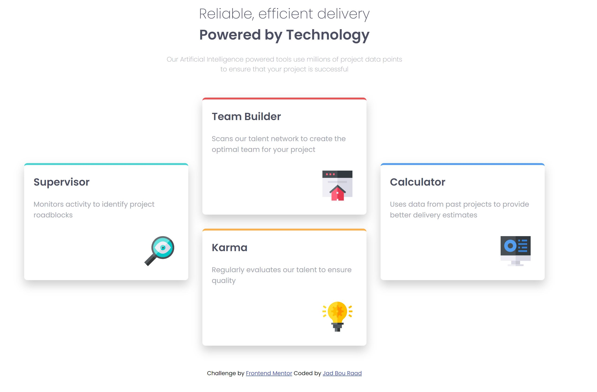

# Frontend Mentor - Four card feature section solution

This is a solution to the [Four card feature section challenge on Frontend Mentor](https://www.frontendmentor.io/challenges/four-card-feature-section-weK1eFYK).

This deisng is to practice the use of flexbox, and the divs distribution inside the file to achieve the design requested

## Overview

This is my 1st challenge done on Frontend Mentor challenges.
The challenged was completed using mainly FLEXBOX for the positioning of the page.
It is still missing the Desktop background svg, and the mobile version (responsive design).

## Technologies Used

- HTML Structure
- Basic CSS properties

  - universal selector
  - background color
  - border radis
  - box-shadow for the cards
  - Flexbox display
  - absolute positioning for card images
  - media queries with several screen widths for a responsive design

- Google fonts link

## Links

- **Solution URL:** https://github.com/J-B-R-93/Four-Card-Feature-Section.git

- **Live Site URL:** https://j-b-r-93.github.io/Four-Card-Feature-Section/

## Screenshot

